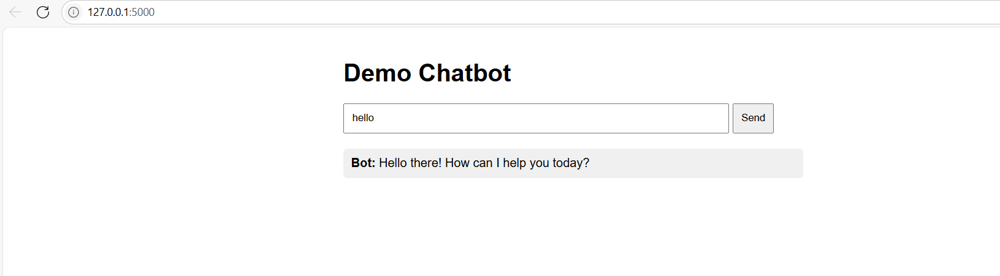

# Template-chatbot
Starter AI chatbot code using Python, HTML and flask API

- Get API keys: https://aistudio.google.com/apikey
- pip install google-generativeai flask
- `python app.py` to run the application on local host

